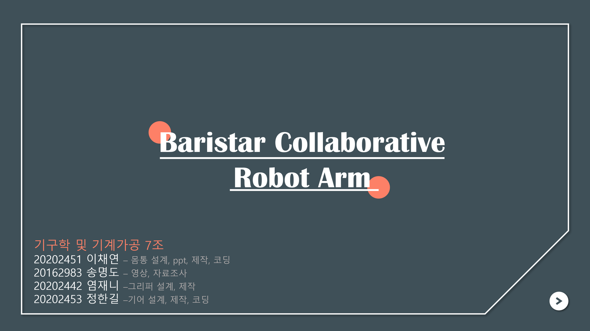
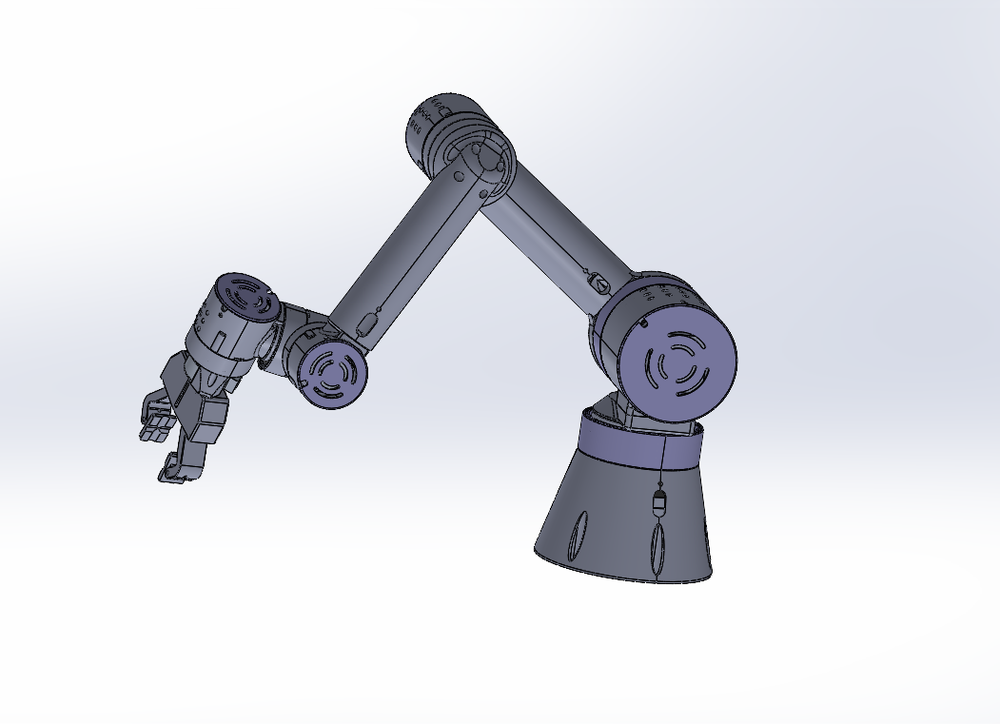
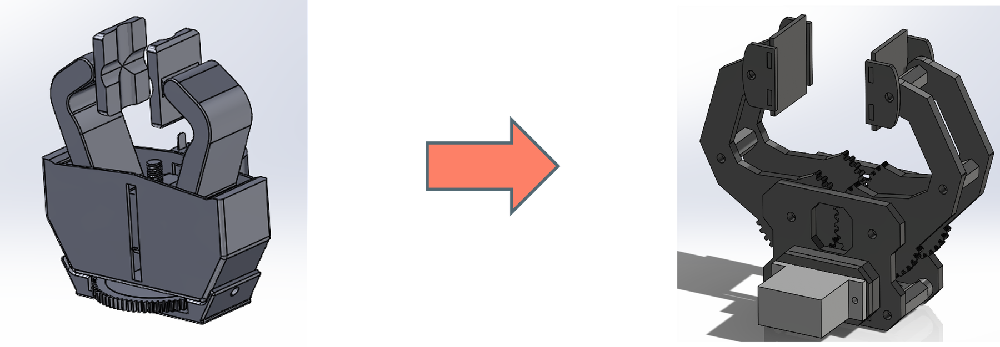
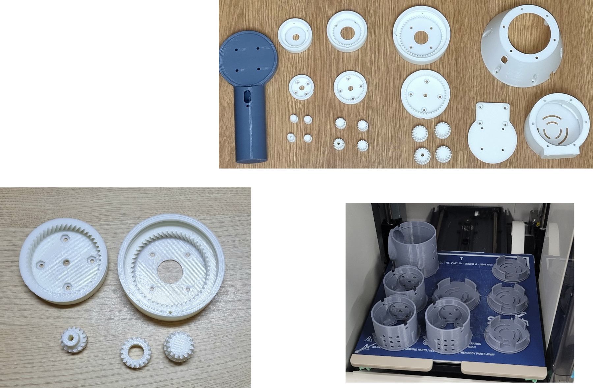
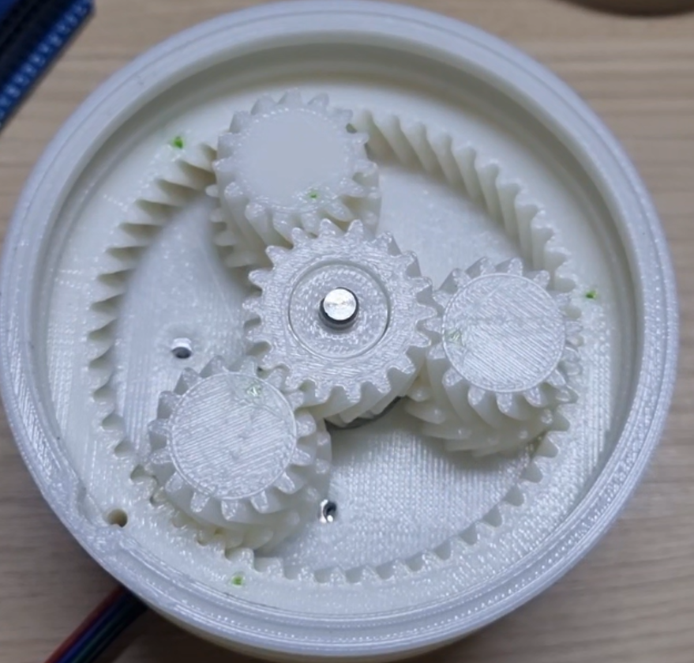
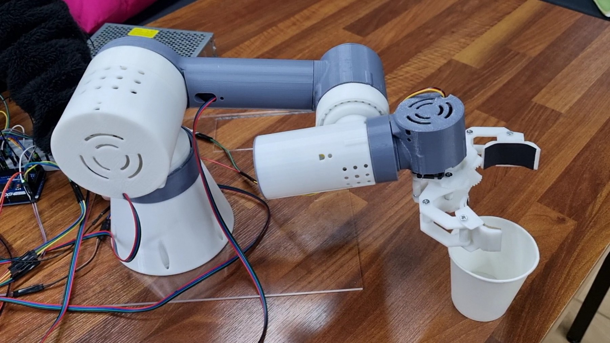
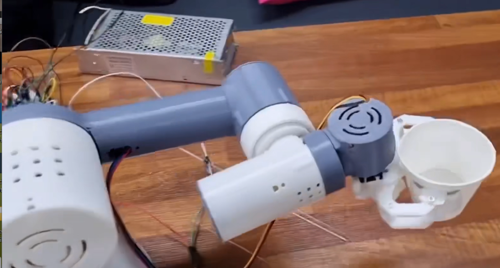
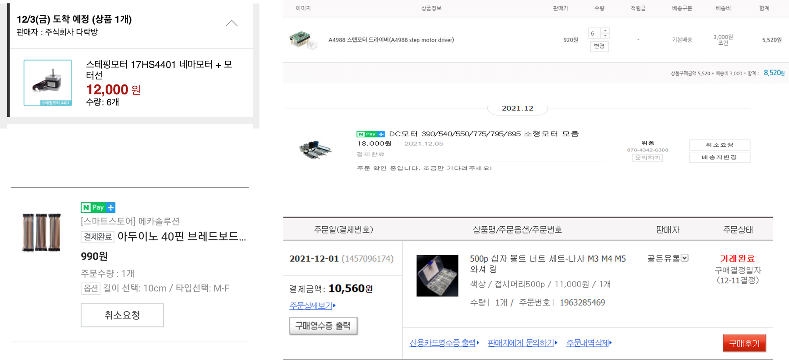

# Serving Bot — Barista Collaborative Robot Arm

## 📌 프로젝트 정보

| 항목 | 내용 |
|---|---|
| 프로젝트 | Barista Collaborative Robot Arm / Serving Bot |
| 형태 | 팀 프로젝트 |
| 주제 | 컵을 잡고 기울여 음료를 따르는 협동 로봇팔 컨셉 구현 |
| 본인 역할 | **그리퍼 설계 및 제작** |
| 시연 영상 | https://www.youtube.com/watch?v=4_AN7rsIiLY |

## 🎯 프로젝트 개요

Serving Bot은 로봇 카페 상황을 가정해, 컵을 잡고 지정 위치로 이동한 뒤 기울기 제어로 음료를 따르는 협동 로봇팔 컨셉 프로젝트입니다. 팀은 로봇팔 몸통, 기어 감속 구조, 그리퍼, 전장 부품, 3D 프린팅 파트를 나누어 설계·제작했고, 최종적으로 3D 프린팅 기반 로봇팔 조립체와 컵 파지/서빙 동작을 시연했습니다.

이 저장소는 코드보다 **프로젝트 문서화와 제작 증거 이미지** 중심으로 구성했습니다. 특히 본인 담당인 그리퍼 설계·제작 과정이 CAD → 구조 변경 → 출력/조립 → 최종 동작으로 이어지도록 정리했습니다.

## ✨ 주요 기능 / 담당 업무

- 컵을 안정적으로 잡기 위한 그리퍼 형상 설계 및 제작
- 컵 파지 후 기울기 동작이 가능하도록 그리퍼 끝단 구조 개선
- 3D 프린팅 출력 파트 조립 및 체결 구조 검토
- 팀 전체 로봇팔 조립·동작 시연 지원

## 🛠 기술 스택

### Mechanical / Fabrication
- 3D CAD 기반 로봇팔 및 그리퍼 설계
- 3D 프린팅 파트 제작
- 그리퍼 링크/체결 구조 설계
- 기어 기반 관절 구동부 조립

### Control / Hardware
- Arduino 기반 모터 제어
- Stepper Motor
- A4988 Stepper Motor Driver
- DC Motor
- Breadboard / jumper wire 기반 전장 연결

## 🔀 시스템 구성 및 동작 흐름

## 📸 프로젝트 흐름 및 이미지 기록
> 역할과 제작 과정을 바로 확인할 수 있도록, 팀 역할 → CAD → 그리퍼 변경 → 출력 파트 → 기어 구조 → 최종 조립/동작 순서로 배치했습니다.

| 화면 | 설명 |
|------|------|
|  | 프로젝트 표지 및 역할 분담 — 본인 역할은 그리퍼 설계·제작으로 정리되어 있음 |
|  | 로봇팔 전체 CAD — 베이스, 관절, 팔 링크, 그리퍼가 결합된 전체 형상 |
|  | 그리퍼 설계 변경 — 초기 박스형 구조에서 컵 파지와 기울기 동작에 맞춘 개방형 그리퍼 구조로 개선 |
|  | 출력 파트 정리 — 몸통, 관절, 기어, 그리퍼 파트를 출력 후 조립 전 상태로 정리 |
|  | 기어 구동부 상세 — 출력 토크 확보와 관절 구동을 위한 기어 조립 구조 |
|  | 최종 조립체 — 3D 프린팅 파트와 전장 부품을 연결한 로봇팔 완성 상태 |
|  | 컵 파지/서빙 동작 — 그리퍼가 컵을 잡고 기울기 동작을 수행하는 시연 장면 |
|  | 전장 부품 준비 — 스텝모터, A4988 드라이버, 브레드보드, 체결 부품 등 제작에 사용한 주요 부품 |

## 🔧 기술적 도전과 해결

### Q1. 컵을 잡는 그리퍼가 너무 단순하면 서빙 동작에서 불안정했다
> **Challenge:** 초기 그리퍼는 컵을 단순히 끼우는 형태에 가까워, 컵을 기울일 때 파지 안정성과 간섭 문제가 생길 수 있었습니다.
> **Solution:** 컵을 감싸는 개방형 그리퍼 구조로 변경하고, 끝단이 컵 외곽을 지지하도록 형상을 조정했습니다. 이를 통해 컵을 잡은 상태에서 기울기 동작을 수행할 수 있는 구조로 개선했습니다.

### Q2. 3D 프린팅 파트는 체결과 조립 오차를 같이 고려해야 했다
> **Challenge:** CAD상으로 맞는 파트도 출력 후에는 치수 오차, 홀 위치, 체결 간섭 때문에 바로 조립되지 않을 수 있었습니다.
> **Solution:** 그리퍼와 관절부를 출력 파트 기준으로 다시 맞추고, 볼트 체결부와 회전 간섭 위치를 확인하며 조립 가능한 구조로 수정했습니다.

### Q3. 로봇팔 관절은 토크와 속도의 균형이 필요했다
> **Challenge:** 컵을 들고 움직이는 구조라 관절 토크가 부족하면 처짐이 발생하고, 반대로 감속이 과하면 동작이 느려질 수 있었습니다.
> **Solution:** 기어 감속 구조를 적용해 관절 구동력을 확보하고, 시연 동작에서는 컵 파지와 기울기 동작이 안정적으로 보이는 속도 범위로 제어했습니다.

## 🎬 시연 영상

▶️ https://www.youtube.com/watch?v=4_AN7rsIiLY
